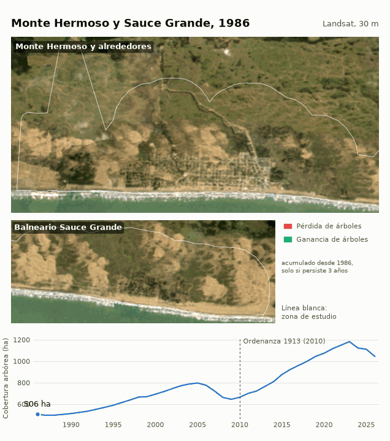

🇬🇧 [English](README.md) · 🇪🇸 [Español](README_es.md)

# Monte Hermoso Tree Analysis 🌳🛰️

An open, reproducible pipeline that detects year-to-year change in woody
vegetation (trees and shrubs) in the **urban area of Monte Hermoso and its
surroundings, and in Balneario Sauce Grande** (about 46.5 km² of the 208 km²
*partido*, on the south coast of Buenos Aires Province, Argentina), from 1985
to 2026, using **only free and public data** processed on Google Earth Engine.
It looks for green space lost to development and tries to keep the swings
caused by droughts from being read as loss. The rest of the partido is kept as
context.

> **Status: research prototype.** The pipeline is engineered, fast and
> reproducible, but detection precision has **not** been validated yet: the
> manual review that measures it is the current bottleneck (see
> [Current status](#current-status-and-validation-)).

Every detected event is a **candidate change** in the satellite signal. The
project does not assume it is a loss of trees: reviewing a labeled sample is
what tells which ones are.



One frame per summer (Sentinel-2 at 10 m from 2017, Landsat at 30 m before, with
cloud gaps filled from neighboring years, which is why early frames can mix
seasons), in two panels at the same scale, with persistent tree loss in red and
tree gain in green, accumulated since 1986, and the tree-like cover of the study
zone below. An interactive map with a year slider is in `docs/index.html`: serve
it with `python3 -m http.server -d docs`, or enable GitHub Pages on `main`
`/docs`; it can also overlay the confirmed 10 m Sentinel-2 events, with
vegetation that turned built-up in orange.

## Main findings 🔎

All figures are for the study zone. They are satellite signals checked against a
small manual review, not a tree inventory.

- **Tree-like cover grew for decades and has fallen since 2023.** From 506 ha in
  1986 to 1,182 ha in 2023 (it more than doubled), then 1,045 ha in 2026
  (-137 ha, -12%). The rest of the partido fell 21% over the same years, so the
  recent decline is not only urban. The last three years are provisional.
- **The rise is mostly afforestation, not city trees.** MapBiomas shows pastures
  turning into plantations and open forest (148 ha between 2010 and 2023, almost
  no loss), which fits the UNS reports of introduced vegetation advancing over
  dunes. Part of the rise is recovery from the 2009 drought, and part is likely
  canopy thickening past our NDVI threshold; we cannot separate them. At 30 m,
  street trees and the 3:1 replanting are invisible.
- **Real-estate development explains little of the loss.** 136 of 749 events
  (16.9 of about 265 ha) are attributed to development, and two small 2020
  developments were confirmed by eye. Single lots are under the 500 m² minimum,
  and the large Monte Hermoso del Este sectors were built before the 10 m series.
- **Other confirmed causes:** clearing in Los Bosques (about 5 ha in 2020) and a
  road cut. The 31 ha patch of December 2025 and the 2024 peak have no known cause
  and wait for higher-resolution imagery.
- **Droughts and seasonality are the main source of false positives.** About half
  of the 2020 hectares, east of Balneario Sauce Grande, were climate. No simple
  rule separated them from real loss without discarding about a third of the real
  ones, so the detector is unchanged apart from a minimum NDVI drop for `cva`.
- **Ordinance 1913 (2010): inconclusive.** The before/after intervals include
  zero, there is no control municipality, and 30 m cannot see replanting.
- **Precision is only partly measured.** Of 37 reviewed events, `veg_to_built`
  was right 10 of 10 and `ndvi_diff` 5 of 8, `cva` 5 of 9 and `dynamic_world` 5 of 10 (wide intervals); 2024 is almost
  unreviewed.

## Study zone 🗺️

The zone is the current urban footprint plus a 1 km margin, so it includes new
blocks, the pine and dune woodland next to town, and the stretch of coast
between the two localities (46.5 km², `data/aoi/zona_urbana.geojson`, also as
KML for Google Earth). It is built by `python3 -m gee_mh.aoi --zona`:

- **Footprint:** MapBiomas Argentina Collection 3 urban class (2025) or Dynamic
  World `built` probability above 0.35 (2024-2026), closed by 150 m to join
  neighboring blocks; only patches over 30 ha count.
- **Clipped** to the partido boundary (IGN, via Georef), extended south because
  its straight southern edge cuts through land at Balneario Sauce Grande, and
  without the sea (Dynamic World water).
- **Los Bosques** (El Americano, 554 ha) is added as its parcel 1050c from the
  municipal zoning plan (484 ha), traced from the PDF and georeferenced against
  the lagoon, plus a 250 m buffer for the georeferencing error.
- **Selection bias:** the zone was chosen because it has buildings today, so its
  rates are not comparable with the countryside's. Comparisons below are context,
  not a control.

## Why it matters 🌊

Monte Hermoso's beach is backed by the *Médanos Blancos* dune field
([municipal site](https://montehermoso.gov.ar/sitio/atractivos/medanos-blancos/)),
and the Pehuen Có–Monte Hermoso Natural Reserve, a 2,000 ha provincial
protected area, lies between Monte Hermoso and Coronel Rosales
([Wikipedia](https://es.wikipedia.org/wiki/Reserva_natural_Pehuen_C%C3%B3-Monte_Hermoso)).

Along the Buenos Aires coast the dunes were widely afforested with non-native
trees: poplars, eucalyptus, Australian acacias, tamarisks and, above all, pines
([Wikipedia](https://es.wikipedia.org/wiki/Dunas_costeras_bonaerenses)). So
"woody cover" here mixes planted exotics, shrubs and urban trees, and a decrease in it is
not automatically ecological damage: it can be urban clearing, plantation
removal or even dune restoration. This project measures **where woody cover
changes** and leaves the interpretation to local managers.

Locally, Ordinance 1,913 of Monte Hermoso (2010) regulates actions that alter
forestation and natural topography, bans altering the dune ridge and requires
replacing three trees for each one removed, as reported by the press
([La Nueva, 2010-08-26](https://www.lanueva.com/nota/2010-8-26-9-0-0-limitaciones-al-retiro-de-arboles));
the ordinance remains in force. An open,
auditable yearly record of where woody cover changes can help managers
cross-check permits and replacement requirements.

## Objectives 🎯

1. Produce a yearly series (1985 to present) of woody-cover change events for
   the urban study zone, as GeoJSON and CSV, with area in m² and hectares, and
   use it to compare the periods before and after Ordinance 1913 (2010).
2. Use free data only, and spend the minimum Earth Engine quota, so that any
   municipality, school or NGO can repeat it.
3. Measure honestly how accurate it is: stratified visual review of detected
   events, plus cross-checks against independent public products.
4. Report trees as a **range/scenario derived from the area of detected change**, never as an
   observed count (10 m pixels cannot resolve individual crowns).
5. Attribute causes (urban development vs. natural) only when evidence
   supports it; otherwise report `desconocido` (unknown).

## Approach: free and open data only 🛰️

| Purpose | Dataset (Earth Engine id) | License | Credit |
|---|---|---|---|
| Imagery, 2015 on (10 m) | Sentinel-2 SR Harmonized (`COPERNICUS/S2_SR_HARMONIZED`) | Copernicus Sentinel data terms | Contains modified Copernicus Sentinel data |
| Imagery, 1985 on (30 m) and the long series | Landsat 5/7/8/9 Collection 2 Level-2 | Public domain (USGS) | Courtesy U.S. Geological Survey |
| Long-series fitting | LandTrendr (`ee.Algorithms.TemporalSegmentation.LandTrendr`) | Apache-2.0 (LT-GEE parameters) | Kennedy et al. 2010 |
| Rainfall (drought context) | CHIRPS Daily (`UCSB-CHG/CHIRPS/DAILY`) | Public domain | Funk et al. 2015 |
| Cloud masking | Cloud Score+ (`GOOGLE/CLOUD_SCORE_PLUS/V1/S2_HARMONIZED`) | CC BY 4.0 | Pasquarella et al. 2023 |
| Land-cover prior and baseline (2015 on) | Dynamic World v1 (`GOOGLE/DYNAMICWORLD/V1`) | CC BY 4.0 | Brown et al. 2022 |
| Independent cross-check (1985-2025) | MapBiomas Argentina Collection 3 | CC BY 4.0 | Project MapBiomas Argentina |
| Earlier cross-check (to 2023) | MapBiomas Pampa Collection 4 | MapBiomas terms (CC BY-SA; their pages are inconsistent) | Project MapBiomas Trinational Pampa |
| Independent cross-check | Hansen Global Forest Change (`UMD/hansen/global_forest_change_2025_v1_13`) | CC BY 4.0 | Hansen et al. 2013 |
| Municipality boundary | IGN Argentina via Georef (datos.gob.ar) | CC BY 4.0 | Servicio Georef – argentina.gob.ar/georef (modified: fields added) |

Full citations are in [NOTICE](NOTICE).

## Pipeline 🏗️

```
Earth Engine: Sentinel-2 / Landsat / Dynamic World / Cloud Score+
   |  1 request per year: cloud-masked summer composite (median, +-30 days of Feb 15)
   v
disk cache (data/cache)  -->  SatelliteImage: reflectance, NDVI/NDBI/NDMI,
   |                          Dynamic World label and tree probability
   v
detection (4 baselines: ndvi_diff | dynamic_world | cva | veg_to_built), each refined by
   - regional NDVI shift of the pair removed (droughts)
   - stable woody mask (woody in year t-1 and t)
   - persistence check (the decline must still hold in year t+1)
   - clip to the municipality polygon, minimum event area
   v
events (exact polygons, cause per polygon)  -->  stratified sample + review_url  -->  precision by stratum
   +-- MapBiomas Argentina C3 cross-check

Landsat 5/7/8/9 summer composites 1985-2026 --> LandTrendr fit per pixel
   --> persistent tree loss/gain, rainfall (CHIRPS), MapBiomas urban area
   --> yearly rates, before/after Ordinance 1913, animation and web map
```

## Engineering notes 🧭

- **One download per year**, not per tile: exact grid via `computePixels`
  (raw bands as `uint16`, one `uint8` land-cover label, one `uint8` tree
  probability). A full run used to take about 30 minutes and crashed on a
  tile-shape mismatch; now the 10 images for 2015-2024 download in about 2.5
  minutes in total (measured), and a re-run is served from the disk cache with
  no Earth Engine requests for imagery.
- LandTrendr over the whole municipality in one request did not finish in
  minutes; the same job in row chunks of 100,000 pixels takes about a minute
  per chunk and is cached on disk afterwards.
- Retry with backoff, request timeouts, and a checkpoint after every processed
  year so a failure never loses finished work.
- Years run in parallel (4 workers, conservative for non-commercial quota).
- Pairs of years with different sensor resolution (30 m vs. 10 m) are skipped,
  because NDVI is not comparable across them.

## Current status and validation 📊

Two tracks answer one question: where did green cover change in the zone, and
was it development?

| Track | Years | Resolution | Use |
|---|---|---|---|
| Detail | 2017-2026 (2016 is a single scene) | Sentinel-2 10 m + Dynamic World | Candidate events, cause attribution, manual review |
| Long | 1985-2026 | Landsat 30 m, fitted with LandTrendr, sensor-corrected | Yearly rates, droughts, before/after the 2010 ordinance |

### Detail track, 2016-2026 (10 m)

Events inside the zone by the year they land on (`year_to`), per baseline, with
a minimum of 5 pixels (about 500 m²; a lot is usually 600 to 1,800 m²). An event
is confirmed when the change still holds the next summer, so 2026 cannot be
confirmed until 2027 exists. `veg_to_built` is any vegetation, not only woody,
that becomes built-up.

| Year | `ndvi_diff` | `dynamic_world` | `cva` | `veg_to_built` | Total |
|---|---|---|---|---|---|
| 2017 | 41 | 11 | 42 | 6 | 100 |
| 2018 | 5 | 1 | 2 | 1 | 9 |
| 2019 | 14 | 0 | 8 | 5 | 27 |
| 2020 | 55 | 11 | 33 | 4 | **103** |
| 2021 | 4 | 0 | 4 | 0 | 8 |
| 2022 | 16 | 0 | 15 | 7 | 38 |
| 2023 | 23 | 1 | 17 | 7 | 48 |
| 2024 | 130 | 5 | 129 | 2 | **266** |
| 2025 | 2 | 0 | 1 | 0 | 3 |
| 2026 | 86 | 2 | 51 | 8 | 147 (not confirmed yet) |

The 2016 composite is a single Sentinel-2 scene (March 2016), so 2016→2017 is
only indicative. 749 events in total, 602 confirmed; the median event is about
1,000 m².

How the detector keeps droughts apart from loss:

- **Regional NDVI shift measured in the whole partido, not in the zone.** A dry
  or atypical summer lowers the NDVI of all vegetation at once. Each pair
  subtracts the median NDVI decline of stable woody pixels of the whole partido
  (0.116 for 2016→2017, 0.040 for 2019→2020, 0.066 for 2023→2024, 0.031 for
  2025→2026; an NDVI rise is not subtracted). Measuring it inside the zone would
  subtract a real zone-wide change from itself as if it were climate.
- **Persistence.** The decline must still hold the next summer.
- **Minimum drop for `cva`.** A `cva` event must lose at least 0.20 NDVI on average
  (`CVA_MIN_NDVI_DROP`). On 31 `cva` events reviewed by eye it removed all 22
  seasonal false positives and lost 3 of 9 real ones, all under 1,100 m². The
  threshold was picked on those same labels, so there is no held-out check yet.
  `ndvi_diff` has no such filter and keeps most of the remaining false positives
  (its 33 events east of Balneario Sauce Grande in 2020).
- **Exact polygons and a cause per polygon.** Each event is attributed on its
  own, using the share of its polygon that Dynamic World calls built-up in the
  two summers after.

What we know:

- **Two peaks, 2020 and 2024.** The 2024 pair is also the highest across the
  whole partido: the median NDVI of trees that were stable in 2018-2019 went
  0.545 (2023), 0.482 (2024), 0.488 (2025), 0.470 (2026) and did not recover,
  although rainfall (CHIRPS, September-March) was 378 mm in 2023, 399 mm in 2024,
  524 mm in 2025 and 499 mm in 2026. Visual review in Google Earth Pro of 2020: the largest site (2.5 ha in Los
  Bosques) is real vegetation loss; the 33 `ndvi_diff` events east of Balneario
  Sauce Grande (7.5 of the 14.9 ha of that baseline), including the 4.5 ha `cva`
  patch there, are seasonal or climate effects, so about half of the 2020
  hectares are false positives. The center of Monte Hermoso (15 events) was not
  reviewed. 2024 is still unexplained and needs the same look.
- **Large 2026 patches.** The biggest 2026 event is about 31 ha northwest of
  Balneario Sauce Grande (-38.983, -61.230): green scrub in 2025 imagery turns
  brown in 2026. NDVI of the polygon fell from 0.47 to 0.13 within five days of
  December 2025 and the scar is still visible in April 2026, although the grass
  regrew. The cause is unknown (no press report found; a NASA FIRMS hotspot on
  December 18 is within 3 km, which does not settle it). Another of about 6 ha
  sits near Camping Americano. Both are unconfirmed.
- **Real-estate development is small and hard to see.** 136 events (16.9 ha) end
  up with at least 30% of their polygon built-up and are labeled
  `desarrollo_inmobiliario`; 1 turns to water or shoreline; the other 612 (248 ha)
  stay `desconocido`. `veg_to_built` finds 40 events, 5.0 ha in total (most years
  between 0 and 7 events). A single house on a lot is far below the 500 m²
  minimum; a cleared block for a development would be visible.
- **Known developments** (`data/reference/desarrollos_inmobiliarios.csv`, located
  from the press, OpenStreetMap and your confirmations; `python3 -m
  gee_mh.developments` counts events within 300 m):
  - **Habitar Monte Hermoso** (Camino Sinuoso Oeste, next to the astronomical
    center; announced in 2022, works from 2022 to 2025): 14 events, 25 ha, in 2023 (6), 2024 (3) and 2026 (5); 9 fall within two years of the start and 6 are labeled `desarrollo_inmobiliario`. This is the one clear match. The
    announced block is about 10 ha, so the 300 m radius also picks up neighboring
    changes.
  - **Monte Hermoso del Este** (402 ha; started in the early 1990s per the UNS
    papers, municipal plans since 1992 per the developer; boundaries from the
    developer's public map, which also gives its sectors): 92 events inside or
    within 300 m. Sector dates: El Viejo Vivero (42 ha, first stage, early 1990s,
    inferred): 20 events; Aldea del Este (8 ha, 2008-2009): 18; Frente Marino (26
    ha, first building 2008, towers promoted in 2022): 54; Pinar del Golf (31 ha):
    47 events, 6 `veg_to_built`, and no published start year. All of these start
    before the 10 m series, so the events are infill inside already-sold sectors
    (lots built on pine), not the original clearing; there is nothing to match by
    year. Because the sectors are adjacent, one event can count in several.
  - **Las Dunas** (about 90 ha between Del Dientudo and Las Ballenas, from the UNS
    paper's boundary streets; its built area doubled between 2004 and 2011): 19
    events, 2 `veg_to_built`, none in that period because the series starts in 2016.
  - **Bungalow** (70 Pro.Cre.Ar II houses on the old Bungalow neighborhood, works
    from March 2022) and **Las Lomas** (private; presented in February 2006 on
    the old Montesol campground, 408 lots on 51 ha, rezoned by ordinance 1559/2006,
    55 lots sold by 2008): 0 events. Both were built on already-occupied or
    pre-2016 land, so a zero here is expected, not a miss.
  - **El Americano / Los Bosques:** the original subdivision (up to 933 lots on a
    507 ha parcel next to the Pehuen Co reserve and the lagoon) was enabled by
    ordinance 2418/2016, in January 2016. Parcel 1050c, traced from the municipal
    zoning plan PDF and georeferenced against the lagoon outline (about 250 m
    error, area 484 ha against the published 507), sits 335 m from the camping and
    reaches the lagoon, which fits where Los Bosques was described; no source
    names it. The zone now covers it entirely. The detector finds 78 events (34.5 ha) inside it,
    none `veg_to_built` and none labeled development: 2017 (28, only indicative), 2020 (7, 10.9 ha), 2024 (13, 7.3 ha), 2026 (26, 10.2 ha). A
    councilor said in April 2026 that the province rejected and cut that
    subdivision and that the current project covers about 49 ha.
  - **Sauce Grande sustainable village** (zone DUE4 of the 2023 urban code, planned
    in 2022, not confirmed built): 11 events within 300 m, 3 within two years of
    2022. The point is approximate; this says nothing about the village itself.
  - Polygons are in `data/reference/desarrollos_poligonos.geojson`. Las Dunas and
    Bungalow are rough rectangles from street ends, not cadastral boundaries.
- Agreement with MapBiomas Argentina Collection 3 (2016-2025, in pixels) is about
  0.7% precision for `cva`, 0.6% for `ndvi_diff`, 0% for `dynamic_world` and 5.8% for `veg_to_built` against MapBiomas urban gain (21 of 362 pixels). This is a
  weak reference: MapBiomas marks few hectares as woody and urban at 30 m, so it
  does not describe the same class.
- `cva` is **uncalibrated**: its precision is unknown until manual labels exist.
- **Ground truth does not exist yet.** The pipeline writes a stratified sample
  (`manual_review_sample.csv`, 52 events). Each `review_url` opens Google Earth
  Web on the event; its historical imagery slider (clock icon) lets you compare
  the summers of `year_from` and `year_to`. Once the `label_true_positive`
  column is filled (1 = confirmed decrease in woody cover, 0 = false
  positive), `python -m gee_mh.validation --labels <csv>` reports precision per
  baseline and size class with 95% Wilson intervals. Re-running
  `compare_baselines` never overwrites a labeled sample.

### Long series, 1985-2026 (30 m)

Landsat 5/7/8/9 summer composites (median of the scenes within ±60 days of
Feb 15, wider than the Sentinel-2 window because before 2000 there are few
scenes) feed LandTrendr, which fits straight segments per pixel: a one-year dip
that recovers is smoothed away, a step that stays remains. Choices that keep the
early years honest:

- **At least two cloud-free observations per pixel and year.** A single scene
  cannot reject a cloud or shadow that the mask missed, so those pixel-years are
  left empty and the fit interpolates. `valid_fraction` in `longterm_rates.csv`
  is the share of the zone that meets this; it is under 80% in 1988, 1990, 1992,
  1993, 1994, 1995, 1996, 1999 and 2013 (1985 has no Landsat scene in the window).
- **Sensor correction.** Landsat 8/9 NDVI runs above Landsat 7 over vegetation
  (median 0.039 in the 2014-2021 overlap, from -0.009 to 0.115 depending on the
  year), so 0.04 is subtracted from it. It is one constant estimated from 8 years.
- **Persistence and drought.** "Tree-like" cover is NDVI ≥ 0.475, the threshold
  that best reproduces Dynamic World's tree class at 30 m (F1 0.51, measured in
  the whole partido). A loss counts only if it is still there three years later,
  and it is measured against the regional NDVI shift of that year (also from the
  whole partido).

Built-up area comes from the MapBiomas urban class: at 30 m NDBI does not
separate buildings from sand (F1 0.12 against Dynamic World), so we do not use
it.

| | 1986 | 2005 | 2009 | 2016 | 2023 | 2026 |
|---|---|---|---|---|---|---|
| Tree-like cover, study zone (ha) | 506 | 797 | 646 | 924 | 1,182 | 1,045 |
| Share of the zone | 10.9% | 17.1% | 13.9% | 19.8% | 25.4% | 22.5% |
| Share of the rest of the partido | 24.2% | 23.5% | 20.9% | 23.2% | 19.7% | 15.6% |

Inside the zone, tree-like cover more than doubled between 1986 and 2023: it
grew almost every year, which is what dune afforestation and maturing urban
trees look like at 30 m, with a dip of about 150 ha between 2005 and 2009 (CHIRPS
September-March rainfall 343 mm in 2006 and 258 mm in 2009, against 450-500 mm in
a normal year). From 2023 to 2026 it lost about 137 ha (12%), and the rest of the
partido lost about 668 ha (21%) over the same years, so the recent decline is not
only urban. The last three years are provisional because the three-year check is
cut short. Rainfall explains almost none of the yearly change (Spearman
correlation 0.05), and 2025-2026 were wet.

**Can it tell what happened before and after Ordinance 1913 (2010)?** It can
measure the rates, but with this data the difference does not clear the
year-to-year noise. Before = 1986-2010 transitions, after = 2012-2026 (the
2010-2011 pair straddles the ordinance). Mean per year, with a permutation test
and the "after" effect adjusted for rainfall (95% bootstrap interval):

| Metric (ha/year), all years | Before | After | p | After effect, rain-adjusted |
|---|---|---|---|---|
| Persistent tree loss | 1.5 | 4.6 | 0.24 | +3.1 (-1.6 to +9.8) |
| Net change in tree-like cover | +6.4 | +23.0 | 0.10 | +16.6 (-6.3 to +35.8) |
| Urban growth (MapBiomas) | 3.5 | 1.1 | 0.09 | -2.4 (-4.5 to -0.6) |

Every interval includes zero except urban growth over all years, and that one
loses its significance once the years with less than 80% valid data are left out
(2.6 against 1.2 ha/year, p = 0.27), so we do not read it as an effect. "Tree
gain" is not in the table because it is zero: the persistent-gain rule needs a
jump of 0.15 NDVI in one year, and gradual greening does not make one, so net
change is the number that carries it. There is no control municipality, the
3-to-1 replacement the ordinance requires cannot be seen at 30 m (urban tree
crowns are smaller than a pixel), and the zone grew greener for decades before
2010 as well. Outputs: `longterm_rates.csv`, `longterm_zone_vs_rest.csv`,
`longterm_events.geojson`, `ordinance_summary.csv`.

### Context: the whole partido

Before the zone was defined, the same pipeline ran over the whole partido (208
km²) with a 1,000 m² minimum, and its outputs are kept in `data/exports/partido/`
(not tracked by git). It found 2,172 events from 2017 to 2026 (202, 108, 147,
185, 190, 115, 144, **429**, 48 and 604 unconfirmed), and its tree-like cover went
4,461 ha (1986), 4,068 (2009), 4,710 (2016), 4,399 (2023) and 3,594 (2026). It is
the source of the regional NDVI shift above and of the "rest of the partido"
column.

## Planned use of Planet imagery 🌍

We plan to apply to Planet's Education and Research program through a
university affiliation. The pipeline already works without Planet data; high
resolution imagery would address its two biggest limits, resolution and
ground truth:

1. **Ground truth.** Visual review of sampled events on ~3 m imagery to build
   the labeled set that today is the bottleneck.
   Open cases to settle with it: the unexplained 2024 peak and the 31 ha patch of
   December 2025 near Balneario Sauce Grande.
2. **Smaller events.** The median detected event is about 1,000 m², roughly 10
   Sentinel-2 pixels but about 110 pixels at 3 m; single houses on a lot are
   below the 500 m² minimum. A zone of about 46 km² is also a manageable area
   for imagery that is requested by area.
3. **Crown calibration.** Sub-10 m imagery to calibrate the area-to-trees
   scenario range in `trees.py`.
4. **Dating and seasonality.** Frequent revisits to date events and separate
   seasonal variation from permanent change.

**Data policy:** this repository does not contain, and will not contain,
Planet imagery or raw Planet pixel values. Anything derived from Planet data
will follow the program's sharing rules and carry the notice
"Image © 20xx Planet Labs PBC". Every result above was produced without Planet
data.

## Quick start 🚀

```bash
pip install -r requirements.txt
earthengine authenticate
# set your own Google Cloud project in config.yaml -> ee_project

export PYTHONPATH=src
python3 -m gee_mh.aoi                 # download the municipality boundary
python3 -m gee_mh.aoi --zona          # build the study zone (urban footprint + 1 km), data/aoi/zona_urbana.geojson
python3 -m gee_mh.compare_baselines --start-year 2016 --end-year 2026
python3 -m gee_mh.external_validation --full --start-year 2016 --end-year 2025
python3 -m gee_mh.validation --labels data/exports/manual_review_sample.csv
python3 -m gee_mh.longterm --start-year 1985 --end-year 2026   # Landsat series, rates, ordinance table
python3 -m gee_mh.developments                                  # events near the known developments
python3 -m gee_mh.animation                                      # docs/monte_hermoso.gif and web map data
```

Offline self-checks (no Earth Engine needed):
`python3 -m gee_mh.preprocessing`, `gee_mh.detection`, `gee_mh.export`,
`gee_mh.validation`, `gee_mh.attribution`, `gee_mh.aoi --selftest`,
`gee_mh.developments --selftest`, `gee_mh.longterm --selftest`,
`gee_mh.external_validation --selftest`.

## Repository layout 📦

| Module | Role |
|---|---|
| `preprocessing.py` | Earth Engine download, composites, indices, disk cache |
| `timeseries.py` | Annual series (parallel), with previous/next year as context |
| `masks.py`, `detection.py` | Land masks, the four baselines, regional NDVI shift, refinement (`detect_pair`) |
| `attribution.py`, `trees.py` | Cause per polygon, tree-count scenario range |
| `longterm.py` | Landsat 1985-2026 series with LandTrendr, rates, before/after the ordinance |
| `animation.py`, `docs/` | Yearly frames, GIF and static web map (`docs/index.html`) |
| `data/reference/` | Public real-estate developments found in news and municipal sources |
| `export.py`, `validation.py` | GeoJSON/CSV/GeoTIFF, metrics, stratified sampling, precision |
| `aoi.py`, `config.py` | Municipality boundary, study zone, `config.yaml` loading |
| `developments.py` | Events near the known real-estate developments |
| `compare_baselines.py`, `external_validation.py`, `pipeline.py` | Entry points |

## Tools 🛠️

- Python, NumPy, pandas
- Google Earth Engine Python API
- GeoPandas, Shapely, rasterio
- OpenCV (connected components, resampling, smoothing)
- PyYAML

## Skills 🧠

- Remote-sensing time series: cloud-masked seasonal composites from
  Sentinel-2 and Landsat
- Change detection and false-positive analysis: finding out what a detector
  actually flags
- Quota-aware data engineering on Earth Engine: single-request downloads,
  disk cache, retries, checkpoints
- Validation design: stratified sampling, Wilson intervals, independent
  cross-checks
- Reproducible research code: offline self-checks, honest reporting of
  negative results
- Open-data licensing and attribution

## Limitations ⚠️

- Woody cover includes shrubs, dune afforestation and plantations; no free
  layer separates natural forest from planted trees.
- A single summer composite per year can still confuse stress or drought with
  an actual decrease in woody cover.
- 10 m imagery cannot count individual trees; at 30 m, urban trees whose
  crowns are smaller than a pixel are invisible, so the long series sees dune
  woodland and plantations, not street trees.
- The study zone was drawn from today's built-up footprint, so it is biased
  toward places that were developed; its rates cannot be compared with the
  countryside's as if it were a control. The Los Bosques parcel is traced from a PDF, with about 250 m of error.
- The long series has too few Landsat observations in the window for 9 years
  (see `valid_fraction`) and 2012-2013 depend on Landsat 7 (striped sensor):
  those years are interpolated. The sensor correction between Landsat
  7 and 8/9 is one constant (0.04) estimated from 8 overlap years. The last
  three years are provisional.
- Before-and-after comparisons have no control municipality and cannot show
  that the ordinance caused a change.
- Real-estate detection depends on Dynamic World's built-up class at 10 m, which
  confuses bright sand with buildings; the cause labels are evidence, not proof.
- Area figures from before the polygon fix came from polygons one pixel too
  small and counted holes as events; the partido-wide numbers above already use
  the fixed ones.
- Detection quality is unmeasured until the labeled sample exists.

## Acknowledgements and license 📎

The idea and initial design come from the Omdena
[Córdoba, Argentina chapter](https://github.com/OmdenaAI/CordobaArgentinaChapter_MonitoringLandUseTransformation)
project on land-use change detection; no files from that repository are
included here. See [NOTICE](NOTICE). Released under the MIT License
([LICENSE](LICENSE)).
